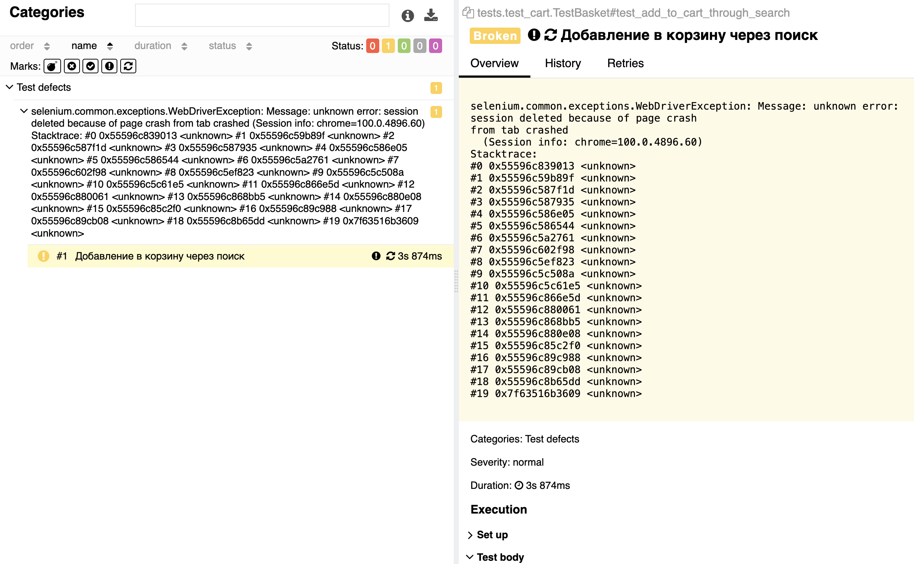
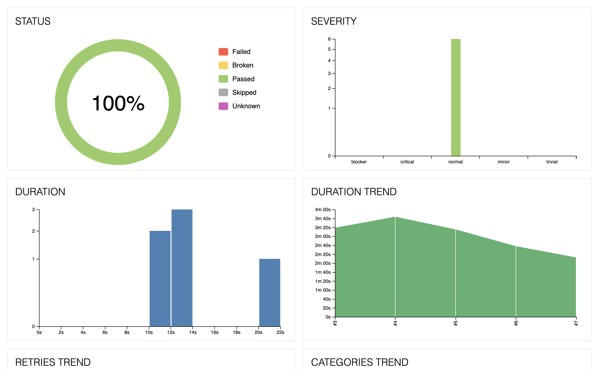
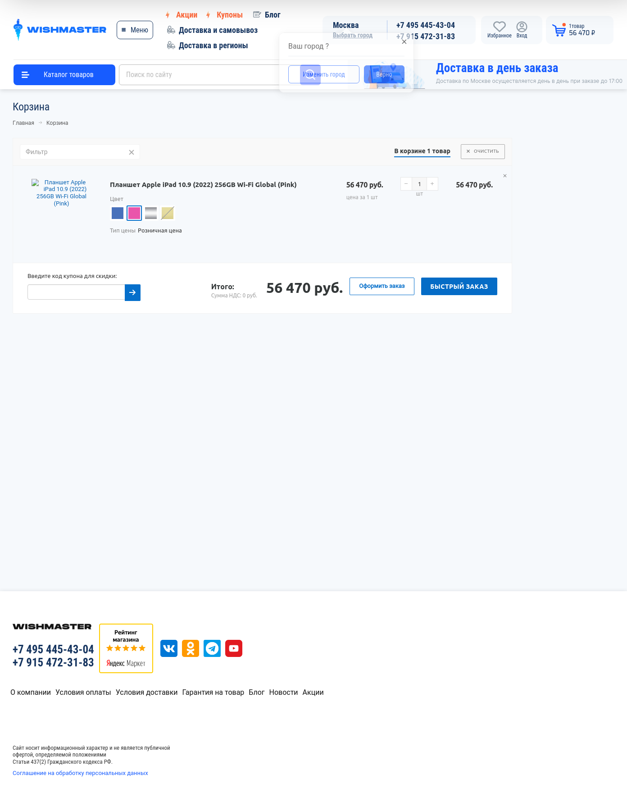
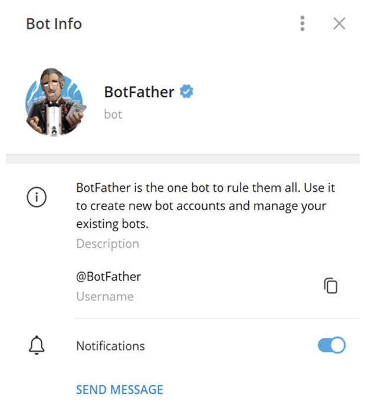
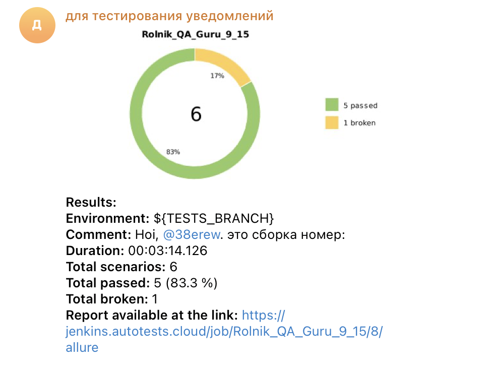

# Wishmaster
## Проект по автоматизации тестирования интернет-магазина


### Особенности:
-  Удаленный запуск через Jenkins
-  Отчетность в allure
-  Запись логов, скриншотов и видео
-  Оповещение в Telegram
-  Время выполнения до 3 минут

### Стек проекта:
Python * Pytest * Selene * (Selenium) * Selenoid * Jenkins * Allure Report * Telegram * Intellij (PyCharm)

<p align="left">


</p>

### Какие проверки реализованы в тестах:
1. Функционал корзины:
   1. Добавление в корзину через каталог 
   2. Добавление в корзину через поиск 
   3. Добавление в корзину через каталог моделей в поиске 
   4. Проверка пустой корзины и очистка
2. Добавление в изрбранное:
   1. Через страницу товара
3. Выбор города:
   1. Проверка отображения выбранного города
- --
#### План развития:
- Авторизация
- Больше сценариев добавления избранное
- Рефакторинг, добавление steps
- Номер сборки в уведомлениях
#### Известные дефекты:
- товары не добавляются в избранное, если кликать на иконку сердечка на странице выбора модели через поиск

## Запуск проекта:
### Через Jenkins
Ссылка на [Job]("https://jenkins.autotests.cloud/job/Rolnik_QA_Guru_9_15/")  

1. Нажмите на кнопку "build with parameters" (собрать с параметрами)

2. Выберите версию браузера. Доступна 100 или 99 версия Google Chrome  
Также можно написать комментарий, который будет отправлен в Telegram после окончания сборки
Нажмите build 

3. Когда тест будет пройден, можно посмотреть подрбности в отчете Allure  
Для это нужно нажать на иконку allure отчета 

#### Структура отчета


- Можно раскрыть тесты и увидеть подробности сборки  

- Можно посмотреть дефекты прогона  

- Можно посмотреть результаты сборки в графиках  

- Можно посмотреть скрины сборки  

- Можно посмотреть запись прохождения теста  


### Локально

1. Клонируйте репозиторий на свой компьютер при помощи git clone
  ```zsh
git clone
  ```
2. Создайте и активируйте виртуальное окружение
  ```zsh
  python -m venv .venv
  source venv/bin/activate
  ```
3. Установите зависимости с помощью pip
  ```zsh
  pip install -r requirements.txt
  ```
4. Для запусков тестов локально используйте команду 
  ```zsh
  pytest tests
  ```
5. Для получения allure отчета
  ```zsh
  allure serve allure-results
  ``` 

## Telegram:   

Возможна интеграция в Telegram, для более удобных оповещений.  

Нужен бот в Telegram @BotFather и чат с правами администратора. 


Пример отчета в Telegram 

